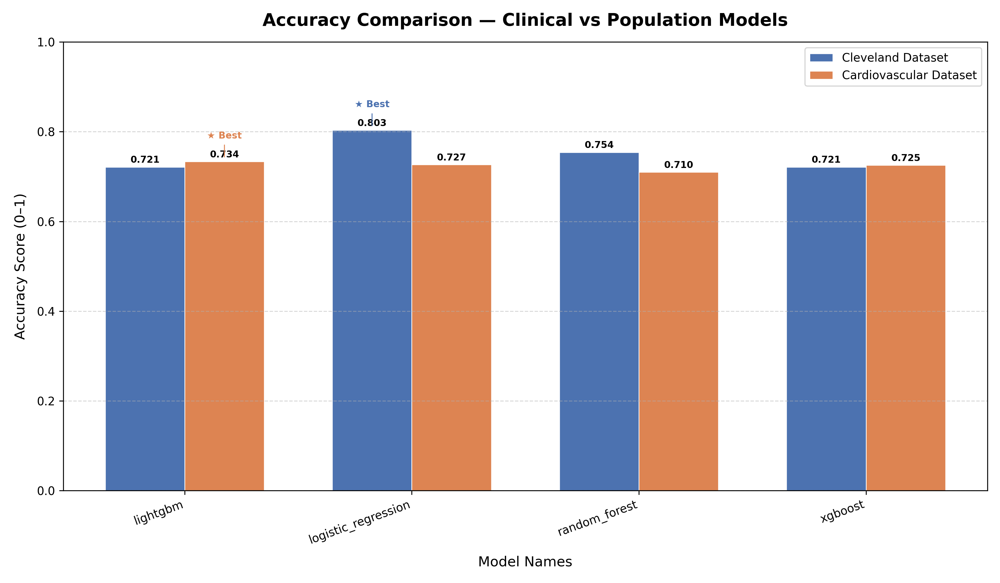

# 🫀 AI-Based Heart Disease Prediction System

---

## 1️⃣ Project Overview

Cardiovascular diseases (CVDs) are the leading cause of death globally. Early detection enables timely medical intervention and lifestyle modification. This project provides a **full-stack AI healthcare decision-support system** that predicts heart disease risk using both **clinical diagnostic data** and **large-scale population screening data**.

The system demonstrates the complete AI lifecycle:

**Data Ingestion → EDA → Preprocessing → Safe Training → Evaluation → REST API → React Frontend.**

The goal is not only prediction accuracy but also **clinical trust, scalability, and real-world applicability**.

---

## 2️⃣ Tech Stack

| Layer | Technology |
|-------|-----------|
| **Language** | Python 3.x |
| **Data Analysis** | Pandas, NumPy |
| **Visualization** | Matplotlib, Seaborn |
| **Machine Learning** | Scikit-learn, LightGBM, XGBoost |
| **Deep Learning (Experimental)** | TensorFlow / Keras |
| **Backend** | FastAPI (Uvicorn) |
| **Frontend** | React 18 (Vite) |

---

## 3️⃣ Dataset Summary

The system uses two complementary datasets representing different stages of healthcare.

| Dataset | File | Records | Features | Source |
|---------|------|---------|----------|--------|
| Cleveland (Clinical) | `heart_cleaned.csv` | ~303 | 13 Clinical Indicators | UCI ML Repository |
| Cardiovascular (Population) | `cardio_cleaned.csv` | ~68,000 | 11 Lifestyle Indicators | Kaggle |

---

## ⭐ Strategic Modeling Logic — The Two-Model Approach

Healthcare decision making occurs at multiple stages. Instead of forcing one model to solve every problem, this system implements **two specialized AI models optimized for different clinical objectives**.

---

### 🩺 Model A — Clinical Diagnostic Model (Cleveland Dataset)

**Goal:** Assist healthcare specialists in confirming diagnosis using advanced clinical indicators.

**Dataset Characteristics:**
- ECG results
- Chest pain classification
- Fluoroscopy vessel measurements
- Stress test information

These are **high-signal diagnostic features** typically available inside hospitals.

#### Optimization Strategy

**Priority:** High Recall + Interpretability.

Missing a diseased patient is more dangerous than generating a false alert.

**Selected Model:** Logistic Regression Pipeline.

**Why Logistic Regression?**
- Highly interpretable feature weights
- Transparent probability outputs
- Clinically explainable decisions
- Stable generalization on small datasets

**Performance:**

| Metric | Value |
|--------|-------|
| Accuracy | 80.3% |
| ROC-AUC | 0.871 |
| Recall | 0.849 |

**Clinical Role:** Doctor-assisted diagnostic confirmation.

---

### ❤️ Model B — Population Screening Model (Cardiovascular Dataset)

**Goal:** Identify heart disease risk patterns across the general population using non-invasive indicators.

**Dataset Characteristics:**
- Height, Weight
- Blood Pressure
- Smoking habits
- Alcohol intake
- Physical activity

These signals reflect lifestyle risk rather than confirmed diagnosis.

#### Optimization Strategy

**Priority:** ROC-AUC + Scalability + Stability.

Population screening must handle noisy, diverse real-world data.

**Selected Model:** LightGBM Gradient Boosting Pipeline.

**Why LightGBM?**
- Efficient training on large datasets
- Captures non-linear feature interactions
- Handles large tabular datasets effectively
- Strong performance stability

**Performance:**

| Metric | Value |
|--------|-------|
| Accuracy | 73.4% |
| ROC-AUC | 0.799 |

**Population Role:** Early risk screening and preventive healthcare monitoring.

---

## 4️⃣ Machine Learning Pipeline (`ml/`)

The project follows a structured workflow to ensure reliability.

---

### Data Preparation

**Outlier Management:**

Clinical features such as cholesterol (`chol`) and resting blood pressure (`trestbps`) are stabilized using Interquartile Range (IQR) Capping.

Values exceeding $Q3 + 1.5 \times IQR$ are capped rather than removed. Dataset size preserved: $N = 1{,}025$.

---

### Duplicate Removal

Duplicate patient records inflate model performance.

**Utility:** `ml/deduplicate.py`

**Strategies:** `keep-first`, `keep-random`, `keep-most-representative`.

**Output:** `ml/data/heart_cleaned_dedup.csv`

---

### Safe Splitting

**Script:** `ml/safe_split.py`

**Features:**
- Stratified 80/20 split
- Zero overlap verification
- Leakage prevention

**Outputs:** `train.csv`, `test.csv`

---

## 5️⃣ The Evolutionary Workflow — Approach 1 → N

---

### Approach 1 — Clinical Baseline

| | |
|---|---|
| **Dataset** | Cleveland (~303 patients) |
| **Model** | Logistic Regression |
| **Goal** | Understand feature influence |
| **Accuracy** | 80.3% |
| **ROC-AUC** | 0.871 |

**Gap Identified:** Small dataset risked overfitting.

---

### Approach 2 — Safe Training Pipeline

**Goal:** Remove optimistic bias.

**Methods:**
- Deduplication
- Leakage detection
- Cross-Validation

**Scripts:** `leakage_scan.py`, `verify_overfitting.py`, `safe_split.py`

**Outcome:** Reliable performance estimates.

---

### Approach 3 — Scaling to Big Data

| | |
|---|---|
| **Dataset** | Cardiovascular (~68K patients) |
| **Focus Shift** | Diagnosis → Population Screening |

**Feature Engineering:**
- Age converted days → years
- Outlier stabilization

---

### Approach N — Gradient Boosting Optimization

| | |
|---|---|
| **Model** | LightGBM |
| **ROC-AUC** | 0.799 |

**Reason:** Traditional linear models reached performance limits.

LightGBM captured:
- Non-linear interactions
- Complex lifestyle relationships

Most stable performance across folds.

---

## 6️⃣ Model Training Summary

### Accuracy Comparison — Clinical vs Population Models



### Cleveland Dataset (Diagnostic Focus)

| Model | Accuracy | ROC-AUC |
|-------|----------|---------|
| Logistic Regression | 0.803 | 0.871 |
| Naive Bayes | 0.787 | 0.887 |
| Random Forest | 0.754 | 0.866 |

### Cardiovascular Dataset (Population Focus)

| Model | Accuracy | ROC-AUC |
|-------|----------|---------|
| LightGBM | 0.734 | 0.799 |
| Logistic Regression | 0.727 | 0.791 |
| XGBoost | 0.725 | 0.787 |

---

## 7️⃣ Backend Integration

**Model Loaders:**
- `backend/app/ml/load_model.py`
- `ml/load_cardio_model.py`

Singleton loading ensures models load once at startup.

**Endpoints:**

| Method | Route | Description |
|--------|-------|-------------|
| GET | `/api/models/` | List all models with ROC-AUC scores |
| GET | `/api/models/best` | Best model metadata |
| POST | `/api/predict/` | Cleveland heart disease prediction |
| POST | `/api/predict/cardio/` | Cardiovascular disease prediction |

---

## 8️⃣ Frontend

React 18 + Vite interface with two user-friendly prediction modes:

- **Clinical Heart Check** — Detailed assessment using medical test indicators
- **Lifestyle Risk Screening** — Quick screening based on lifestyle and health factors

**Features:**
- Card-based model selection with tooltips
- Inline form validation
- Risk result cards with probability display

---

## 9️⃣ Setup

Run the entire system:

```powershell
.\START_SYSTEM.ps1
```

| Service | Port |
|---------|------|
| Backend | 8000 |
| Frontend | 5173 |

---


